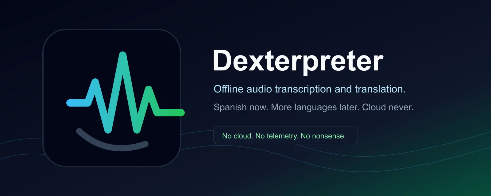
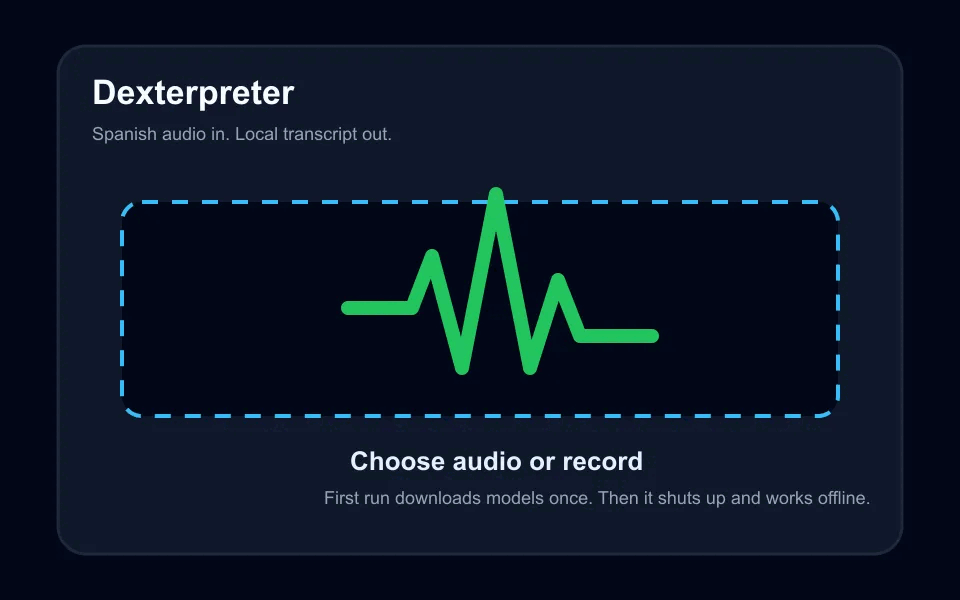

---
[](https://github.com/westkitty/spanish_translator)

---

<div align="center">


</div>

<p align="center">
Offline audio transcription and translation.
</p>
<p align="center">
No cloud. No telemetry. No nonsense.
</p>

<div align="center">
  
</div>

<p align="center">Dexter understands you.</p>
<p align="center">Unfortunately.</p>

---

<h2 align="center">Dexterpreter</h2>

---

## What This Is

Dexterpreter is a local/offline audio transcription and translation app. Version
1.0.0 supports the Spanish path:

1. Spanish audio in.
2. Spanish transcript out.
3. English translation out.

The product is not permanently Spanish-branded. The architecture is meant to
grow into additional language paths without turning the app into a cloud
translator wearing a suspicious hat.

## Demo



The demo uses synthetic UI frames and synthetic text only. No private audio, no
personal screenshots, no local metadata.

## Install

When `v1.0.0` is published, download the Android package from the
[GitHub Releases page](https://github.com/westkitty/spanish_translator/releases).

Release artifacts prepared by this repository use these names:

- `Dexterpreter-1.0.0-android.apk` for a signed release APK, when local signing
  credentials are supplied.
- `Dexterpreter-1.0.0-android-unsigned.apk` when a release APK is built without
  local signing credentials.
- `Dexterpreter-1.0.0-android-debug.apk` when only a debug build is available.
- `Dexterpreter-1.0.0-SHA256SUMS.txt` for checksums.

Android may ask you to allow installing an app from the browser or file manager.
That is normal for sideloaded APKs. Read the prompt. Then read it again, because
Android likes ceremony.

## Requirements

- Android device with a modern WebView.
- Enough storage for the app, ONNX runtime, Whisper model, and translation model.
- Internet once on first launch to cache the model files.
- No backend. No account. No server pretending to be local.

## First Launch

The first transcription downloads the selected Whisper model once. The default
balanced model is about 85 MB. The Spanish-to-English translation model is also
cached locally.

After the models are cached, transcription and translation run offline. If you
clear app storage, reinstall the app, or choose a model tier that has not been
cached yet, Dexterpreter will need network access once again for that model.

## Current Language Support

Current release support is deliberately narrow:

- Spanish audio transcription.
- Editable Spanish transcript.
- English translation from the Spanish transcript.

Other source languages are not complete in version 1.0.0. The code is structured
for expansion, but this release ships Spanish-to-English. Marketing has been
kept on a short leash.

## Full Feature List

- Local file import for common audio formats.
- Microphone recording permission flow.
- On-device Whisper transcription through Transformers.js and ONNX Runtime.
- Word-timestamped transcript editing.
- Spanish punctuation restoration.
- Sentence review and read-along controls.
- Waveform playback, scrubbing, loop controls, and selected-region re-run.
- Local project library using browser storage.
- Export to text, SubRip subtitles (SRT), Web Video Text Tracks (VTT), bilingual
  subtitles, comma-separated values (CSV), and timed JSON.
- Clipboard copy for transcript and translation.
- Theme controls and accessibility-focused keyboard improvements.

## Privacy & Security

Audio stays on-device. Dexterpreter does not upload audio, transcripts,
translations, project data, or usage data.

The app has no analytics, telemetry, tracking, account system, backend, cloud
application programming interface (API), or remote job queue.

Release signing credentials are not committed. Local signing is configured with
environment variables only.

## Offline Model Cache

Dexterpreter caches model files in local browser/WebView storage. Cached models
are reused for later runs.

Model tiers:

| Tier | Model | Approximate cache |
|---|---|---:|
| Fast | `Xenova/whisper-tiny` | 45 MB |
| Balanced | `Xenova/whisper-base` | 85 MB |
| Accurate | `Xenova/whisper-small` | 250 MB |

The translation path uses `Xenova/opus-mt-es-en`.

## Export Formats

- Plain text: Spanish transcript plus English translation.
- SRT and VTT subtitles.
- Bilingual subtitle output.
- CSV word timing export.
- Timed JSON.
- Clipboard copy.

## Build From Source

```bash
cd <repo>/frontend
npm install
npm run build
```

Development server:

```bash
cd <repo>/frontend
npm run dev
```

## Android Release Build

Debug APK:

```bash
cd <repo>/frontend
npm install
npm run build
npx cap sync android
cd android
./gradlew assembleDebug
```

Unsigned release APK:

```bash
cd <repo>/frontend
npm install
npm run build
npx cap sync android
cd android
./gradlew assembleRelease
```

The unsigned artifact prepared in `dist/release/` is
`Dexterpreter-1.0.0-android-unsigned.apk`. Sign it locally before treating it as
a final public release package.

Locally signed release APK:

```bash
cd <repo>/frontend
export DEXTERPRETER_RELEASE_STORE_FILE=~/path/to/repo-private/release.keystore
export DEXTERPRETER_RELEASE_STORE_PASSWORD=...
export DEXTERPRETER_RELEASE_KEY_ALIAS=...
export DEXTERPRETER_RELEASE_KEY_PASSWORD=...
npm install
npm run build
npx cap sync android
cd android
./gradlew assembleRelease
```

Do not commit keystores, passwords, or signing credentials. Basic, yes. Still
apparently necessary.

## Development Workflow

```bash
cd <repo>/frontend
npm install
npm run build
npm run test
npm run eval:gate
```

`eval:gate` currently excludes the demo fixture from aggregate scoring. Treat it
as an evaluation harness check unless real reference fixtures are added.

## Repository Layout

```text
frontend/
  src/                 React and TypeScript app
  src/lib/             Audio, export, model, storage, and inference helpers
  android/             Active Capacitor Android project
docs/
  images/readme/       Synthetic README media
assets/
  branding/            Canonical Dexterpreter branding
dist/release/          Prepared release artifacts
```

Root-level generated `android/` and `ios/` trees are intentionally not used as
the build source of truth.

## Validation

Release validation should include:

- `npm run build`
- `npm run test`
- `npm run eval:gate`
- `npx cap sync android`
- `./gradlew clean assembleRelease` or `./gradlew clean assembleDebug`
- SHA-256 checksum generation for produced APKs

Do not claim signed release validation unless a locally signed APK was actually
built.

## Troubleshooting

If first launch appears stuck, check the model download and network connection.
If later offline runs fail, confirm app storage was not cleared.

If Android release signing fails, confirm the four
`DEXTERPRETER_RELEASE_*` environment variables point to local, uncommitted
credentials.

If accuracy is poor, try the Accurate model tier and review the transcript
before judging the English translation. Bad input produces bad output. It is
not a philosophical event.

## Roadmap

- Real release-device demo capture.
- Non-demo accuracy fixtures for `eval:gate`.
- Additional language paths after the Spanish-to-English path is stable.
- Better model cache controls.
- Signed release publishing for `v1.0.0`.

## License

No license file is currently present in this repository. Add one before making
broad reuse claims.

## Final Note

Dexterpreter is local software for local work. It listens, writes down what it
heard, translates it, and does not phone anyone about it.
